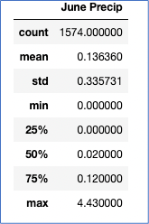
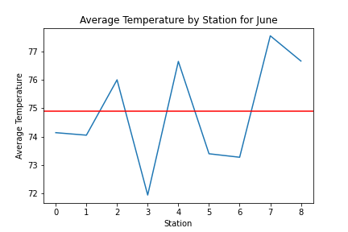
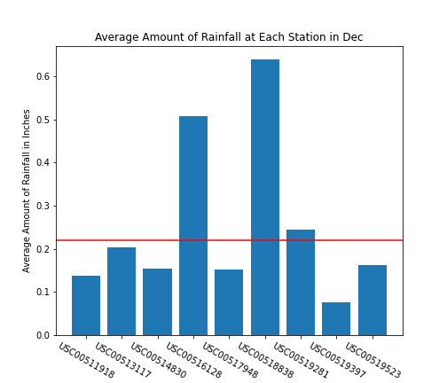

# Surfs_Up

## Overview

This analysis examines weather data to determine if a Surf n’ Shake Shop is sustainable in Oahu, Hawaii. The data are presented to potential investors. A statistics summary was generated for the temperatures and precipitation during the months of June and December as well as examining results by location of each weather station. Preliminary results indicate that Oahu would a good location to open the shop.

## Results

The temperatures were retrieved for the months of June and December and summary statistics for each month were generated. The summaries are presented in the figures below. 

<figcaption align = "center"><b>June Temps</b></figcaption> 

 

<figcaption align = "center"><b>Dec Temps</b></figcaption>

Key differences in temperatures between June and December are:

* There are 183 more temperatures recorded during the month of June than in the month of December.
* The average temperature in June is almost 4 degrees higher than in December. Also the there is less variability among the temperatures in June than in December which is indicated by the standard deviation.	
* There is a wider range of temperatures in the month of December than in June. 

## Summary

The temperature results for June and December indicate that Oahu is potentially a good location for a Surf ‘n Shake shop. However, this analysis is quite limited. Further analyses should be conducted to gain confidence in our decision. One such analysis examined the average precipitation for the months of June and December.

 

These results indicate that December brings more precipitation on average than June. Also, there is more variability among the measures of precipitation in December than in June as is indicated by the standard deviation. In general, even though December shows a larger average precipation than June, overall the quanitity of precipitation indicated is still reasonable.

While June and December offer somewhat similar weather results, the location of the best waves for summer may not be the same within those months. Thus, an additional analysis was completed for average temperature observations aggregated by the location of each station and another for average precipitation aggregated by the location of each station. 
Recall the average temperature in June overall was determined to be 74.9. The line chart below presents the average temperature in June by each station with the red horizontal line indicating the overall average of 74.9. As is evident in the figure, there can be quite a bit of difference based on the location of the station. However, all averages range between 72 – 79', so the temperature is still quite comfortable. 

The trend for December is similar as observed in the figure. The red horizontal line represents the overall average of 71.  

When examining the average amount of rainfall aggregated by station, it is immediately apparent that in June at least one station is recording a significant amount more average precipitation that the others  and in December at least two stations see an significant difference in average precipitation.  This raises questions as to whether these locations are as desirable as maybe other locations on the island to build the shop.

  

